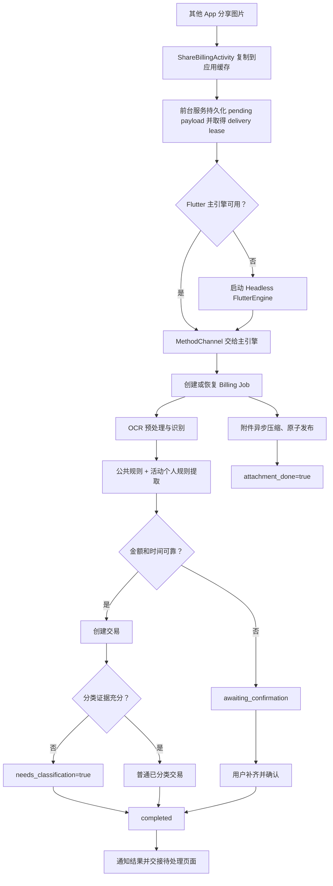
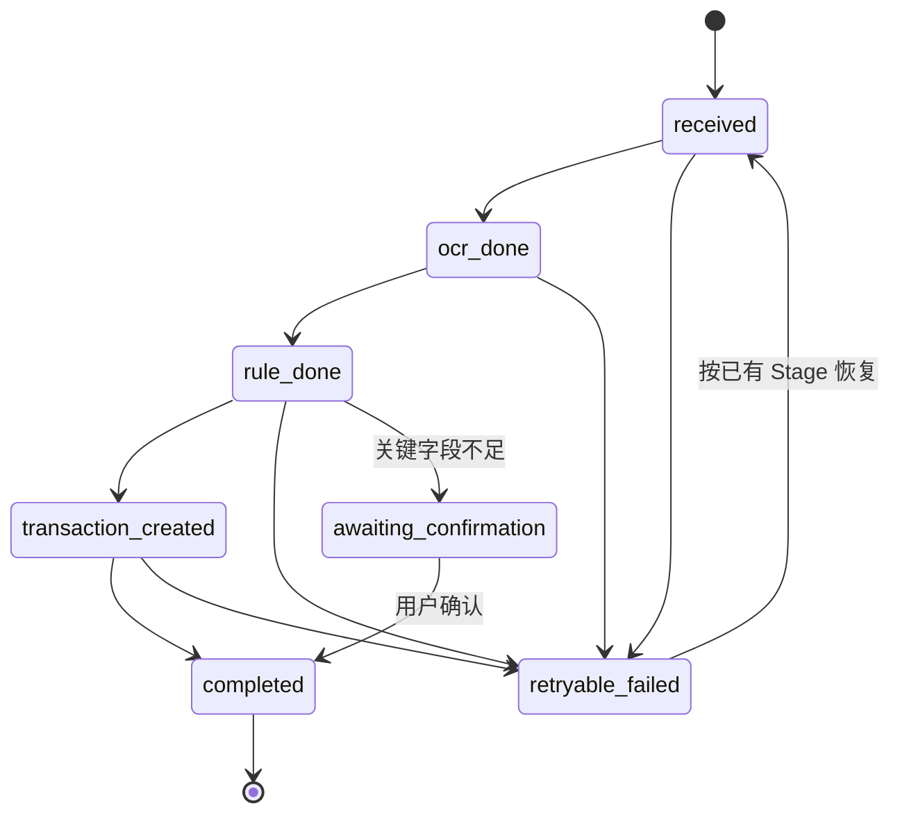

# 分享图片记账全流程与代码审查记录

> 更新日期：2026-07-26  
> 范围：Android 系统分享图片进入 BeeCount，直到账单创建、待确认/待分类补正、附件恢复和个人规则学习。  
> 本文描述当前代码的真实行为；架构决策以 `docs/adr/` 和 `CONTEXT.md` 为准。

## 1. 核心术语

- **Billing Job**：一次图片分享记账请求的持久化生命周期记录。
- **Stage**：主流程进度，依次为 `received → ocr_done → rule_done → transaction_created → completed`。
- **附件状态**：`attachment_done` 独立于主流程 Stage；账单可以先创建，附件稍后恢复。
- **待确认账单**：金额或时间不足以安全建账，Job 进入 `awaiting_confirmation`，等待用户补齐。
- **待分类账单**：金额和时间足以建账，但分类证据不足；交易立即创建，并设置
  `needs_classification=true`。
- **活动个人规则**：通过个人规则回归门禁后，可以影响后续图片记账的本地确定性规则。

术语来源：`CONTEXT.md:1-78`、`docs/adr/0004-local-deterministic-share-billing-rules.md:1-17`。

## 2. 主流程总览

主要入口：

- Android 接收和缓存：`android/app/src/main/kotlin/com/tntlikely/beecount/ShareBillingActivity.kt:34-102`
- 前台服务和 MethodChannel：`android/app/src/main/kotlin/com/tntlikely/beecount/ShareBillingForegroundService.kt:40-139,175-326`
- Flutter 请求协调：`lib/services/platform/share_billing_request_coordinator.dart:62-145`
- Job 服务：`lib/services/billing/billing_job_service.dart:181-325`
- Stage 编排：`lib/services/billing/billing_job_runner.dart:173-428`

## 3. Android 分享入口与可靠交付

`ShareBillingActivity` 只接受 `ACTION_SEND` 且 MIME 为 `image/*` 的 Intent。它从
`EXTRA_STREAM`、`ClipData` 或 `Intent.data` 读取 URI，把内容复制到应用缓存，然后启动
`ShareBillingForegroundService`。原始外部 URI 不直接交给 Dart，避免授权在异步处理期间失效
（`ShareBillingActivity.kt:39-95,108-125`）。

前台服务先把请求写入 `share_billing_payloads` SharedPreferences，再领取一个带
`deliveryOwnerToken` 和过期时间的 delivery lease。主 Flutter 引擎准备好时从队列取请求；
不可用时服务创建 Headless 引擎。请求完成、失败或转入待确认时，原生侧依据 requestId 和
owner token 更新或移除持久 payload
（`ShareBillingPendingPayloadStore.kt:13-92`、
`ShareBillingPendingPayloadPolicy.kt:58-139`）。

Flutter 侧 `ShareBillingRequestCoordinator`：

1. 启动 delivery lease 心跳；
2. 更新“正在准备识别账单”状态；
3. 调用图片处理服务；
4. 并行观察交易是否已创建，以便尽早显示“账单已创建”；
5. 根据最终结果发送 `completeShareBilling`、`awaitingShareBillingConfirmation`
   或 `failShareBilling`
   （`share_billing_request_coordinator.dart:62-168`）。

## 4. Billing Job 状态机、租约与恢复

状态常量位于 `lib/data/repositories/billing_job_repository.dart:4-22`。`ai_done` 只为旧数据
迁移兼容；数据库 v27 会把它迁为 `completed`
（`lib/data/db.dart:939-949`）。

`BillingJobRunner` 为每次执行领取数据库 lease，并在耗时处理期间续租。Stage 的持久写入通过
`PipelineContext.requireOwnedWrite` 绑定当前 lease，过期 owner 不能更新 Job。交易创建在生产
路径使用原子能力，把交易插入与 Job 的 `transaction_id` 更新放在同一事务中
（`billing_job_runner.dart:173-324`、
`stages/transaction_stage_processor.dart:166-191`）。

应用初始化时，`ImageShareHandlerService` 同时：

- 排空原生 pending payload；
- 调用 `BillingJobService.resumePendingJobs()` 恢复 `pending/retryable_failed` Job；
- 查找 `awaiting_confirmation` Job 并打开用户确认页
  （`image_share_handler_service.dart:80-132`）。

## 5. OCR、标准化与规则提取

OCR Stage 先检查 Job 是否已有结果，保证恢复时不会重复 OCR；新请求经
`OcrImagePreprocessor` 预处理后调用 `OcrService`。OCR 服务以 RapidOCR 为优先实现，并通过
文本可用性判断决定是否回退 ML Kit；空文本会成为可分类失败
（`lib/services/billing/stages/ocr_stage_processor.dart:22-68`、
`lib/services/billing/ocr_service.dart`、
`lib/services/billing/ocr_text_quality.dart`）。

Rule Stage 固定本次 Job 使用的规则快照，然后执行：

1. 公共 TOML 规则；
2. SQLite 中的活动个人规则；
3. 账单字段标准化；
4. 支付渠道、优惠、结构化摘要和分类证据补全。

规则快照会随 Job 持久化；恢复时如果旧快照仍可用就继续使用，否则显式迁回
`ocr_done` 重新固定，而不是把新旧规则混在同一次 Job 中
（`lib/services/billing/stages/rule_stage_processor.dart:77-154`、
`lib/services/billing/rules/billing_rule_repository.dart`、
`lib/services/billing/deterministic_bill_enrichment.dart`）。

公共规则位于 `assets/rules/billing_rules.toml`；个人规则、偏好、修订、冲突和活动状态以
SQLite 为权威。两者必须使用相同 normalization version
（`docs/adr/0004-local-deterministic-share-billing-rules.md:19-48`、
`lib/services/billing/rules/billing_rule_models.dart:120-142`）。

## 6. 三种交易结果

### 6.1 直接完成

金额为正且时间存在时，Transaction Stage 调用 `BillCreationService` 创建交易。分类规则命中
且证据可靠时，交易直接带分类完成
（`stages/transaction_stage_processor.dart:111-192`、
`bill_creation_service.dart:376-507`）。

### 6.2 待分类

金额和时间可靠、分类不可靠时仍立即创建交易，以兜底分类作为当前显示，并持久化
`needs_classification=true`。通知和前台导航把交易交给
`PendingTransactionClassificationPage`。用户可以：

- 仅修正本次；
- 对当前账本记住；
- 对所有账本记住。

记住规则要求可验证的商户/来源证据和稳定 category syncId
（`pending_transaction_classification_service.dart:27-144`、
`pending_transaction_classification_page.dart:41-358`）。

### 6.3 待确认

金额缺失、非正数或时间缺失时不创建交易；Job 保存候选字段并进入
`awaiting_confirmation`。用户在 `PendingBillConfirmationPage` 补齐字段并确认后，
`PendingBillConfirmationService` 创建交易、把 Job 更新为 `completed/succeeded`，再尝试学习
提取修正、分类规则和备注偏好。可选学习失败不会回滚已经确认的交易
（`pending_bill_confirmation_service.dart:137-360`）。

## 7. 附件发布与恢复

附件与主流程并行。发布器以 Job 的稳定 originKey 建立幂等身份：

1. 将压缩结果写入同目录唯一临时文件；
2. 完整读取并实际解码验证；
3. 在数据库 fencing 回调中再次确认 lease；
4. 原子 rename 为稳定文件；
5. 以数据库唯一约束 upsert 附件记录；
6. CAS 设置 `attachment_done=true`。

源码：`lib/services/billing/stages/attachment_stage_processor.dart:23-82`、
`lib/services/billing/billing_attachment_publisher.dart:42-149`、
`lib/data/repositories/local/local_billing_job_repository.dart:169-212`。

启动恢复先建立一次附件文件名索引，再按 Job originKey 查询，复杂度目标为 `O(F+J)`。
坏文件不会被收养；项目删除规则要求实现不得自动删除用户文件
（`docs/specs/share-billing-attachment-recovery.md:51-73`）。

## 8. 个人规则闭环

用户确认修正不会直接覆盖公共 TOML。系统先生成受约束的个人候选规则，再计算回归影响集，
用本机加密的 OCR 回归样本验证：

- 本次修正必须正确；
- 既有受影响样本的最终账单字段不能退化；
- 通过后才原子启用为活动个人规则；
- 冲突规则保持可见且不静默覆盖。

相关实现：

- 候选规则生命周期：`lib/services/billing/rules/personal_rule_lifecycle_service.dart`
- 加密回归样本：`lib/services/billing/regression_sample_store.dart`
- Android Keystore 存储：`android/app/src/main/kotlin/com/tntlikely/beecount/regression/EncryptedRegressionSampleStore.kt`
- 成功样本录制：`lib/services/billing/successful_regression_sample_recorder.dart`
- 多设备同步：`lib/services/billing/rules/personal_rule_sync_service.dart`

完整 OCR 样本不进入普通同步载荷；同步的是规则、修订、冲突和必要元数据
（`docs/specs/share-image-personal-rule-loop.md:58-96`）。

## 9. 通知和前台页面交接

`BillingNotificationMapper` 根据 Job 主流程、附件状态和待确认状态生成用户文案。交易已创建但
附件未完成时会显示“账单已创建，附件稍后保存”；待确认和待分类使用独立 provider 交给
`PendingBillingNavigationHost`，后者按队列顺序打开相应页面
（`billing_notification_mapper.dart:1-76`、
`pending_billing_navigation_host.dart:37-155`、
`pending_billing_navigation_coordinator.dart:20-147`）。

## 10. 代码审查：遗留问题与优化建议

以下为 2026-07-26 对当前 HEAD 的静态审查结果。P1 应优先修复；P2 可按可靠性和隐私批次处理。

### P1：delivery lease 过期后旧 owner 仍可续约和提交终态

`ShareBillingPendingPayloadPolicy.renew/isCurrentOwner/removeIfOwner` 只比较 token，没有验证
`dispatchLeaseUntil > now`（`ShareBillingPendingPayloadPolicy.kt:114-138`）。旧执行者暂停超过
150 秒后，只要尚未被新 owner 抢占，仍可续约、完成或删除 payload，破坏 fencing 语义。

建议：所有 owner mutation 同时校验 token 和未过期时间，或引入单调 generation；新增
“到期但未被重抢也拒绝 renew/complete/awaiting”测试。

### P1：处理失败后交易轮询未取消

`ShareBillingRequestCoordinator` 启动 `_notifyWhenTransactionCreated` 后先等待主处理 Future；
主处理抛错时轮询 Future 没有取消或等待，仍可能运行 90 秒并发送迟到 MethodChannel 调用
（`share_billing_request_coordinator.dart:97-105,139-168`）。

建议：使用可取消的结构化并发；在 `catch/finally` 中终止并等待观察器；补主处理失败后的
迟到交易测试。

### P1：pending payload JSON 损坏会静默丢弃整队列

`readRootLocked()` 捕获任意解析/迁移异常后直接返回空 JSON
（`ShareBillingPendingPayloadStore.kt:94-102`）。下一次分享会把空 root 写回，永久覆盖所有
待处理请求。

建议：保留并隔离原始值、逐 entry 容错恢复、记录可观测错误；无法恢复时给用户明确失败通知。

### 已修复：同步提取冲突不再阻断关键字段完整的账单

规格规定只有金额和时间是建账前关键字段
（`docs/specs/deterministic-billing-classification-completion.md:15-17`）。当前
`TransactionStageProcessor` 只在金额缺失/非正或时间缺失时进入待确认；
`sync_extraction_conflict` 不再单独阻断建账
（`transaction_stage_processor.dart:121-140`、
`transaction_stage_processor_test.dart:153-176`）。

### P2：待确认完成后附件不在当前会话立即续跑

首次附件任务等待 `transactionIdFuture`；主流程进入待确认时该 Future 失败
（`attachment_stage_processor.dart:54-72`、`billing_job_runner.dart:387-390`）。用户确认只更新
交易和 Job 终态，没有重新调度附件
（`pending_bill_confirmation_service.dart:240-246`）。附件通常要等下一次 App resume 才恢复。

建议：确认成功后显式调用只恢复附件的入口，避免重跑 OCR/规则/交易；测试当前前台会话只发布
一次附件。

### P2：原生失败通知存在乱码

Headless 默认状态和失败状态仍有 mojibake：
`ShareBillingForegroundService.kt:188,281,323`。替换为正确 UTF-8 中文，并给 fallback 分支增加
通知内容测试。

### P2：日志记录完整图片路径和外部 URI

`ShareBillingForegroundService.kt:268,303,316,343` 记录完整缓存路径；
`ShareBillingActivity.kt:47-50,95-100` 记录 Intent data/URI 和原始异常消息。它们可能进入持久
日志或 bug report。

建议：生产日志只保留 requestId、脱敏 hash 和错误类别；路径/URI 仅在受控 debug 模式记录。

### P2：附件验证造成重复全量内存读取

`billing_attachment_publisher.dart:65-69,105-114` 对 prepared/stable 图片重复全量读取和解码。
超大图片可能造成明显内存峰值甚至 OOM。

建议：分享入口限制字节数和像素数；采用采样解码/尺寸探测；避免对已验证稳定文件重复全量读。

### 产品后续 TODO

“查找相似历史账单、预览并批量确认”仍被明确留在范围外，尚未实现
（`docs/specs/share-image-personal-rule-loop.md:82,105`、
`docs/specs/deterministic-billing-classification-completion.md:45-49`）。

### 验证债务

- `test/services/billing/rules/runtime_billing_rule_repository_test.dart:106` 仍期待规则版本
  `2026.07.26.1`，当前内置资源为 `2026.07.26.2`，导致全量 `flutter test` 失败。
- `docs/test-plan-billing-jobs.md` 仍保留早期状态说明，但没有同步当前 630+ 测试的完成矩阵，
  不宜继续作为实时完成度来源。
- 远程规则更新依赖 `BEECOUNT_BILLING_RULE_MANIFEST_URL`；未配置或地址不安全时会按设计禁用，
  发布流程必须确认生产构建参数
  （`billing_rule_update_configuration.dart:10-86`）。

## 11. 建议处理顺序

1. 修复原生 delivery lease 过期 fencing，并加 Kotlin 单测。
2. 修复请求协调器的未取消轮询和 pending payload 损坏恢复。
3. 用户确认完成后立即恢复附件。
4. 修复通知乱码并收紧敏感日志。
5. 增加图片大小/像素边界，降低附件内存峰值。
6. 修正规则版本断言，恢复全量测试绿色。
7. 单独立项相似历史账单预览/批量确认。

## 12. 关键验证入口

- Job 状态机：`test/services/billing/billing_job_runner_test.dart`
- Job 集成与恢复：`test/services/billing/billing_job_integration_test.dart`
- OCR Stage：`test/services/billing/stages/ocr_stage_processor_test.dart`
- 规则 Stage：`test/services/billing/stages/rule_stage_processor_test.dart`
- 交易 Stage：`test/services/billing/stages/transaction_stage_processor_test.dart`
- 附件恢复：`test/services/billing/stages/attachment_stage_processor_test.dart`
- 原生 delivery：`test/services/platform/share_billing_delivery_test.dart`
- 待确认：`test/pages/billing/pending_bill_confirmation_page_test.dart`
- 待分类：`test/pages/billing/pending_transaction_classification_page_test.dart`
- 真机安全要求：`docs/android-real-device-test-safety.md`
