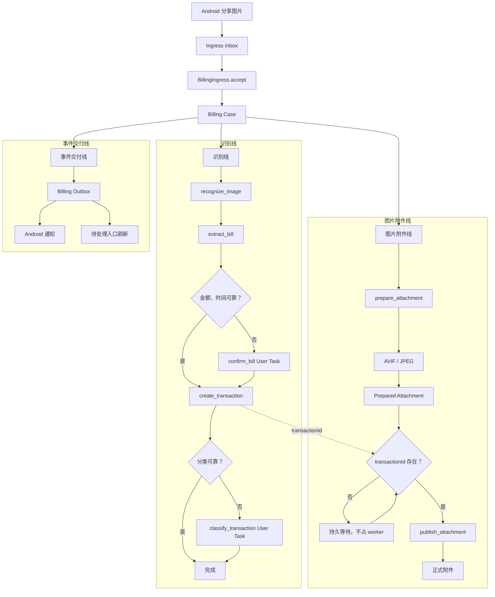

# 分享图片记账工作流 V2 重构规格

## 1. 文档状态

- 状态：已确认，待实现
- 平台：Android
- 日期：2026-07-26
- 决策记录：`docs/adr/0005-local-billing-case-and-work-queues.md`
- 旧实现审查：`docs/share-image-billing-flow.md`

本文定义分享图片记账的目标运行时。V2 完全替换现有 Billing Job Stage Runner、长生命周期
原生 delivery lease 和基于临时 Provider 的待处理交接；已有交易、附件、个人规则、回归样本
和未完成工作必须迁移，不长期维护双轨运行时。

## 2. 目标

1. 一张分享图片只创建一个 Billing Case，最多创建一笔交易。
2. 自动处理、用户处理、图片附件和通知交付彼此独立、可恢复。
3. 任意 worker 失去 lease 后永久失去提交副作用的权限。
4. 等待用户期间不持有数据库事务、worker 或 delivery lease。
5. 图片转换与 OCR 在接收后立即分叉并行。
6. 待分类优先展示；待确认通过 OCR 证据裁决，而不是要求用户从空白表单录入。
7. 临时工作流只保存在本设备；待分类完成前不上传交易。
8. 通知丢失、App 终止或设备重启不导致工作丢失。
9. 敏感 OCR 证据加密保存，临时图片严格限时清理。
10. 个人规则学习失败不回滚已经确认的交易。

## 3. 非目标

- 不引入运行时云端 AI 或本地小模型。
- 不自动追溯修改历史交易。
- 不同步 Billing Case、自动任务、用户任务、OCR 证据、临时图片或 Outbox。
- 不保留旧运行时双写或长期兼容分支。
- 不在本重构中实现“查找相似历史账单、预览、批量确认”。
- 不把通知或页面 Provider 作为业务状态来源。
- 不在等待用户期间保持数据库长事务。

## 4. 领域模型

### 4.1 Billing Case

Billing Case 表示一次分享图片记账从接收到业务终态的本地工作流。它持有请求身份、账本、
源图片引用、宏观状态、识别产物引用和最终交易引用，不持有 worker 执行细节。

状态：

- `accepted`：已可靠接收，尚未开始自动处理。
- `automating`：至少有一个自动任务可运行、运行中或等待重试。
- `waiting_confirmation`：金额或时间需要用户裁决。
- `waiting_classification`：交易已创建，分类需要用户裁决。
- `completed`：交易已创建且无待处理用户任务。
- `cancelled`：用户放弃尚未创建交易的待确认工作。
- `permanent_failure`：自动重试耗尽或遇到不可恢复错误。

### 4.2 Automation Task

Automation Task 是机器可抢占、可重试的本地工作。每个任务拥有独立状态、重试计划和
generation lease。

任务类型：

- `recognize_image`
- `extract_bill`
- `create_transaction`
- `prepare_attachment`
- `publish_attachment`
- `learn_personal_rule`
- `deliver_outbox`
- `cleanup_artifacts`

任务状态：

- `ready`
- `running`
- `retry_wait`
- `completed`
- `permanent_failure`
- `cancelled`

### 4.3 User Task

User Task 是等待本设备用户裁决的持久工作，不使用后台 lease。

任务类型：

- `confirm_bill`：从 OCR 证据选择或编辑金额、时间。
- `classify_transaction`：为已经创建的交易选择分类。

任务状态：

- `open`
- `resolved`
- `cancelled`
- `expired`

### 4.4 Prepared Attachment

Prepared Attachment 是已经完成格式转换、完整解码验证，但可能尚未绑定交易的附件候选。
它独立于 OCR 和交易创建。

状态：

- `pending`
- `preparing`
- `prepared`
- `publishing`
- `published`
- `retry_wait`
- `permanent_failure`

### 4.5 Billing Outbox Event

Billing Outbox Event 是业务状态已提交、等待本地外部交付的事件。它承载通知和 App 内入口
刷新，不决定 Billing Case 或 User Task 是否存在。

事件类型：

- `billing_processing`
- `billing_created`
- `confirmation_required`
- `classification_required`
- `billing_completed`
- `billing_failed`
- `attachment_failed`

## 5. 总体架构



## 6. 持久化模型

### 6.1 `billing_cases`

建议字段：

- `id`
- `request_id`，唯一
- `ledger_id`
- `source_image_path`
- `source_info_json`
- `state`
- `version`
- `encrypted_ocr_evidence`
- `extraction_result_json`
- `transaction_id`
- `sync_allowed`
- `cleanup_after`
- `created_at`
- `updated_at`
- `completed_at`

约束：

- `request_id` 全局唯一。
- 一个 Case 最多引用一笔交易。
- `waiting_classification` 必须存在 `transaction_id`。
- `waiting_confirmation` 不得存在已完成的 `confirm_bill`。
- `completed` 不得存在 open User Task。

### 6.2 `billing_automation_tasks`

建议字段：

- `id`
- `case_id`
- `kind`
- `state`
- `available_at`
- `attempt`
- `lease_owner`
- `lease_generation`
- `lease_until`
- `last_error_code`
- `created_at`
- `updated_at`

约束：

- `(case_id, kind)` 唯一。
- 只有 `ready`、到期 `running` 和到时 `retry_wait` 可以被 claim。
- 每次 claim 增加 `lease_generation`。
- 所有副作用提交必须匹配 generation 且 lease 未过期。

### 6.3 `billing_user_tasks`

建议字段：

- `id`
- `case_id`
- `kind`
- `state`
- `transaction_id`
- `draft_json`
- `resolution_json`
- `version`
- `created_at`
- `resolved_at`
- `expires_at`

约束：

- `(case_id, kind)` 唯一。
- `classify_transaction` 必须引用交易。
- 用户提交使用 `state + version` 乐观并发控制。

### 6.4 `billing_prepared_attachments`

建议字段：

- `id`
- `case_id`，唯一
- `source_path`
- `prepared_path`
- `content_hash`
- `mime_type`
- `byte_length`
- `width`
- `height`
- `state`
- `error_code`
- `created_at`
- `prepared_at`
- `published_at`

### 6.5 `billing_outbox`

建议字段：

- `id`
- `case_id`
- `user_task_id`
- `event_type`
- `payload_json`
- `state`
- `attempt`
- `available_at`
- `created_at`
- `delivered_at`

Outbox 只负责可靠交付，不保存业务真值。

## 7. 深 Module 与 Interface

### 7.1 BillingIngress

Interface：

```text
accept(SharedImageEnvelope) -> BillingCaseId
```

Implementation 隐藏：

- requestId 去重；
- Case 创建；
- 初始 OCR、图片转换和 Outbox 任务创建；
- 原生 Inbox acknowledge 顺序；
- 外部 URI 到应用私有文件的转换。

### 7.2 BillingAutomation

Interface：

```text
runAvailable(workerIdentity, timeBudget) -> AutomationRunResult
```

Implementation 隐藏：

- claim、renew、generation fencing；
- OCR、规则和附件 Adapter；
- 重试分类；
- 后续任务创建；
- Case 状态转换；
- Outbox 写入。

### 7.3 BillingUserWork

Interface：

```text
watchOpen() -> Stream<UserTaskSummary>
resolve(taskId, expectedVersion, answer) -> UserWorkResolution
cancel(taskId, expectedVersion) -> UserWorkResolution
retryFailed(caseId) -> RetryResult
```

Implementation 隐藏：

- 待确认与待分类差异；
- OCR 证据解密；
- 交易创建和分类更新；
- 同步门禁；
- 个人规则学习任务；
- 附件发布唤醒；
- Outbox 写入。

### 7.4 BillingArtifactLifecycle

Interface：

```text
runDueCleanup(now) -> CleanupSummary
```

Implementation 只处理数据库中记录的精确应用私有路径，不扫描任意目录、不使用通配符。

## 8. Ingress 与原生交付

1. `ShareBillingActivity` 接收 `ACTION_SEND image/*`。
2. 原始 URI 内容复制到 BeeCount 内部私有目录，文件名使用随机 requestId。
3. 私有临时目录排除 Android Auto Backup 和系统迁移。
4. 原生 Ingress Inbox 持久保存 requestId、路径、来源和短 delivery lease。
5. Flutter 调用 `BillingIngress.accept`。
6. Case 和初始任务提交成功后，立即 acknowledge 原生 Inbox。
7. OCR、附件、用户等待和通知不再延长原生 delivery lease。
8. ack 前崩溃允许重复交付，`request_id UNIQUE` 保证只创建一个 Case。

delivery lease 必须检查 owner token、generation 和未过期时间。lease 到期表示旧 owner 永久
失去提交权，不能续租复活。lease 丢失不计入业务失败次数。

## 9. 自动处理与并发

全局并发上限：

- 同时最多 1 个 `recognize_image`。
- 同时最多 1 个 `prepare_attachment`。
- 同一 Case 的 OCR 与图片转换可以并行。
- 多个 Case 可以排队，待用户任务不阻塞新 Case。

调度：

- 分享后由 Foreground Service 触发即时处理。
- 30 秒、5 分钟重试和延迟清理由 Android WorkManager 触发。
- App 启动或回前台补偿扫描 `ready/retry_wait`。
- 所有入口共用 SQLite 队列和 generation fencing。

重试：

- 临时错误最多自动尝试 3 次：立即、30 秒、5 分钟。
- 数据库忙、OCR 引擎异常和暂时转换失败可重试。
- 源文件不存在、图片损坏等不可恢复错误直接进入处理失败。
- OCR 没有可靠候选不是技术失败，进入待确认。
- 用户手动重试会重置自动尝试次数。

## 10. 待确认：候选字段裁决

待确认只表示用户可以依据原图和 OCR 证据补齐金额或时间，不作为数据库、权限或存储异常的
通用兜底。

界面：

- 上方显示原始图片。
- 图片上显示可点击 OCR 文本框。
- 下方分别显示金额候选和时间候选。
- 点击图片框或候选列表填入对应字段。
- 已选文本块高亮。
- 填入值允许继续编辑。
- 无合适候选时允许直接手动填写。
- 默认“仅本次”；明确选择“记住类似账单”才创建个人候选规则。
- 允许“放弃本次记账”，关闭页面不等于放弃。

自动处理转待确认使用一个短 SQLite 事务：

1. 校验当前 Automation Task generation。
2. 保存加密 OCR 证据和候选草稿。
3. Case 转为 `waiting_confirmation`。
4. 创建 `confirm_bill/open`。
5. 完成当前自动任务。
6. 插入 `confirmation_required` Outbox。

事务提交后不持有 worker 或数据库锁。

用户确认使用另一个短事务：

1. 校验 User Task 仍 open 且 version 匹配。
2. 创建交易。
3. 解决 `confirm_bill`。
4. 分类可靠则 Case 完成；否则创建待分类任务。
5. 若 Prepared Attachment 已存在，创建发布任务。
6. 创建异步个人规则学习任务。
7. 插入 Outbox。

## 11. 待分类

分类不可靠时仍创建本地交易，但设置同步门禁，不上传临时兜底分类。

界面：

- 统一待处理入口默认打开“待分类”Tab。
- 显示图片、金额、时间、商户摘要和当前临时分类。
- 使用现有一级/二级分类选择体验。
- 支持直接新增二级分类。
- 默认“仅本次”。
- “记住类似账单”要求可验证的商户、商品或来源证据。
- 个人分类规则默认当前账本，可主动设为所有账本。

自动处理转待分类使用短事务：

1. 校验当前 Automation Task generation。
2. 创建交易并设置 `needs_classification=true`、`sync_allowed=false`。
3. Case 写入 transactionId，转为 `waiting_classification`。
4. 创建 `classify_transaction/open`。
5. 完成自动建账任务。
6. 唤醒附件发布条件。
7. 插入 `classification_required` Outbox。

用户完成分类使用另一个短事务：

1. 校验 User Task open、version 匹配。
2. 更新交易分类并清除 `needs_classification`。
3. 设置 `sync_allowed=true`。
4. 解决 User Task，Case 转为 `completed`。
5. 创建异步个人分类规则学习任务。
6. 插入完成 Outbox。

## 12. 统一待处理入口

首页顶部提供“待处理账单”入口和总数红点：

1. 待分类，默认 Tab。
2. 待确认。
3. 处理失败。

每个 Tab 按接收时间从旧到新排序。完成一条后可以自动打开下一条，也可以返回列表跳过。

待分类交易也在账单列表显示待分类标记。待确认尚未创建交易，只出现在统一入口。处理失败
只展示自动重试耗尽或不可恢复、且用户可以重试或放弃的 Case。

## 13. 图片附件线

`prepare_attachment` 与 OCR 同时进入 ready：

1. 校验源图片大小、格式和像素边界。
2. 修正方向并按上限等比缩放。
3. 默认编码 AVIF。
4. AVIF 编码失败自动降级 JPEG。
5. 完整解码验证输出。
6. 保存 MIME、尺寸、字节数和哈希。
7. 标记 Prepared Attachment。

OCR 始终读取原始缓存图，不读取压缩附件。

发布条件：

```text
Prepared Attachment = prepared
AND Billing Case.transactionId != null
```

图片先准备完成时持久等待，不占 worker；交易先创建时同样不轮询。两个完成事务都调用同一个
内部调度规则，依靠 `(case_id, kind)` 唯一约束只创建一个 `publish_attachment`。

待确认不会阻止图片转换；用户确认创建交易后立即触发发布。待分类已经有交易，附件可正常
发布。附件失败不回滚交易，也不改变待确认或待分类状态。

## 14. Outbox 与通知

业务状态和待发送事件在同一个短事务中提交。Outbox worker 成功交付后标记 delivered；App
崩溃或通知权限暂时不可用时保留事件并重试。

通知策略：

- 多任务处理使用一条汇总前台进度通知。
- 不为每个内部 Stage 单独通知。
- 无需处理的交易完成后发送独立结果通知。
- 待分类通知携带 userTaskId，直达分类页。
- 待确认通知携带 userTaskId，直达 OCR 裁决页。
- 处理失败通知直达“处理失败”条目。
- 附件只在最终重试失败时单独提示。
- 通知只是投影；所有入口从本地数据库恢复。

## 15. 本地范围与同步

以下内容只保存在本设备：

- Billing Case
- Automation Task
- User Task
- Outbox
- OCR 证据和候选
- 原始临时图片
- Prepared Attachment
- 失败与清理状态

同步规则：

- 无需用户处理的交易创建后立即允许同步，不等待附件。
- 待确认尚未创建交易。
- 待分类交易在分类完成前禁止上传。
- 分类完成后交易立即允许同步。
- 正式附件发布后走独立附件同步。
- 个人规则学习结果走现有个人规则同步。
- 工作流本身永不上传。

## 16. 个人规则学习

字段裁决或分类修改默认只影响本次。只有用户明确选择“记住类似账单”才创建个人候选规则。

交易提交后异步执行：

1. 生成受约束个人候选规则。
2. 计算回归影响集。
3. 解密本机回归样本并验证。
4. 通过后原子启用。
5. 失败时保留本次交易，提示未能记住规则。

规则学习不阻塞交易、附件或同步。重复任务不得创建结构等价规则。规则只影响未来账单，不
自动修改历史交易。

## 17. 隐私与安全

- OCR 全文、切块文本、坐标和候选证据使用独立 Keystore 包装数据密钥加密。
- 工作流 OCR 密钥与个人规则回归样本密钥分离。
- 金额、时间等工作流必要结构化字段可以保存在 Case 中。
- 临时图片放在应用内部私有目录，随机 requestId 文件名。
- 临时目录和 OCR 证据排除 Android Auto Backup。
- 不在日志记录 OCR 原文、金额、时间、商户、绝对路径或外部 URI。
- 日志只记录 requestId、taskId 和稳定错误码。
- 完整个人规则回归样本继续按 ADR-0004 独立加密和管理。

## 18. 取消、失败与清理

用户取消：

- 待确认允许“放弃本次记账”。
- 待分类已经创建交易，不提供放弃工作流；用户可以完成分类或进入交易详情处理交易。
- 关闭页面不等于取消。

保留周期：

- 成功且正式附件已发布：临时源图和 Prepared 文件保留24小时。
- 用户主动放弃：临时文件保留24小时。
- 处理失败：原图和中间文件保留3天，期间允许重试。
- 完成的 Case、任务、已解决 User Task 和 delivered Outbox 保留10天。
- 10天后删除 OCR 证据、候选、坐标和内部诊断，仅保留必要业务数据。
- 个人规则回归样本不受10天策略影响。

清理规则：

- 只处理数据库记录的 BeeCount 私有临时文件精确路径。
- 不扫描任意目录，不使用通配符。
- 不清理原始相册文件或正式交易附件。
- 清理失败只重试，不影响交易状态。

## 19. 迁移

正式发布一次性切换到 V2，不长期双轨：

1. schema migration 在 SQLite 事务中执行。
2. migration 成功后直接启用新运行时。
3. 不执行额外全库一致性扫描或运行时门禁。
4. SQL migration 失败由 SQLite 回滚。
5. 不自动降级运行旧代码。

旧数据映射：

| 旧状态 | V2 Case | V2 工作 |
|---|---|---|
| pending / retryable_failed | automating | 创建第一个未完成 Automation Task |
| awaiting_confirmation | waiting_confirmation | `confirm_bill/open` |
| 交易 needsClassification | waiting_classification | `classify_transaction/open` |
| succeeded / completed | completed | 未完成附件创建附件任务 |
| 无法映射的异常旧任务 | permanent_failure | 进入处理失败，保留3天 |

已有交易、正式附件、个人规则、回归样本和同步身份原样保留。

## 20. 替换与删除范围

V2 切换后删除旧运行时代码，不继续增加兼容分支：

- Billing Job Stage 状态推进与恢复 switch。
- 长生命周期原生 delivery lease。
- 原生 payload 中的 awaiting confirmation Job 状态。
- `PipelineContext.transactionIdFuture` 式附件等待。
- 基于 `unawaited` 的附件并行交接。
- 待处理 Provider 临时队列作为事实来源。
- 两套通知状态映射。
- 旧 AI Stage 兼容运行路径。

数据库迁移器可以保留旧 schema 读取逻辑，但新运行时不得再写旧工作流状态。

## 21. 测试与验收

### 21.1 核心不变量

1. 一个 requestId 最多一个 Case。
2. 一个 Case 最多一笔交易。
3. 过期 generation 永远不能提交副作用。
4. 自动工作和用户工作不能同时拥有同一业务动作。
5. 每个未完成 Case 至少能被一个持久队列发现。
6. 通知丢失不丢任务。
7. 待确认、待分类不依赖原生 delivery lease。
8. 图片转换与 OCR 可以独立恢复。
9. 附件最多发布一次。
10. 待分类完成前交易不能上传。

### 21.2 故障注入

覆盖每个状态提交前后：

- 原生 ack 前后崩溃；
- OCR 完成前后崩溃；
- 图片转换完成前后崩溃；
- 交易创建事务前后崩溃；
- 待确认和待分类交接前后崩溃；
- lease 到期后旧 worker 返回；
- 两个 worker 同时 claim；
- 用户重复点击或两个页面同时提交；
- Outbox 交付失败；
- 附件原子发布中断；
- WorkManager 和前台 Worker 同时唤醒。

### 21.3 性能

- OCR 全局并发1。
- 图片转换全局并发1。
- claim 使用索引查询，不扫描历史 Case。
- 待处理入口使用状态和时间组合索引。
- 大图在解码前检查字节和像素边界。
- 已验证的稳定附件不重复全量读取和解码。
- 用户队列数量不影响新分享进入自动队列。

### 21.4 Android 真机

遵守 `docs/android-real-device-test-safety.md`：

- 禁止 `flutter test ... -d`。
- 禁止 uninstall、`pm clear` 和 `flutter clean`。
- Patrol 使用 `--no-uninstall` 并验证 `run-as` 哨兵。
- 使用包含旧未完成 Job、待分类交易和附件恢复状态的升级夹具。

## 22. 实施切片

1. 新 schema、迁移和数据访问层。
2. BillingIngress 与 requestId 去重。
3. Automation Queue 与 generation lease。
4. OCR、规则 Adapter 接入。
5. 图片转换与 Prepared Attachment。
6. 原子建账、待确认和待分类交接。
7. BillingUserWork 与统一待处理入口。
8. 附件发布任务。
9. Outbox、通知和 App 内刷新。
10. WorkManager 重试与清理。
11. 个人规则异步学习。
12. Android Ingress 简化。
13. 真实旧数据迁移与真机验收。
14. 切换入口并删除旧运行时代码。

每个切片以 V2 Interface 为测试 seam；不以旧 Stage 私有方法作为新测试面。

## 23. 关键代码路径索引

以下路径用于定位现有实现和未来替换 seam，不在本文复制具体代码。

### Android 分享与前台处理

- `android/app/src/main/kotlin/com/tntlikely/beecount/ShareBillingActivity.kt`
- `android/app/src/main/kotlin/com/tntlikely/beecount/ShareBillingPayload.kt`
- `android/app/src/main/kotlin/com/tntlikely/beecount/ShareBillingForegroundService.kt`
- `android/app/src/main/kotlin/com/tntlikely/beecount/ShareBillingPendingPayloadStore.kt`
- `android/app/src/main/kotlin/com/tntlikely/beecount/ShareBillingPendingPayloadPolicy.kt`
- `android/app/src/main/kotlin/com/tntlikely/beecount/ShareBillingMainEngineBridge.kt`

### Flutter 平台交接

- `lib/services/platform/image_share_handler_service.dart`
- `lib/services/platform/share_billing_request_coordinator.dart`
- `lib/services/platform/share_billing_delivery.dart`
- `lib/services/platform/share_billing_processing_outcome.dart`
- `lib/services/platform/share_billing_background_service.dart`

### 旧 Billing Job 运行时

- `lib/services/billing/billing_job_service.dart`
- `lib/services/billing/billing_job_runner.dart`
- `lib/data/repositories/billing_job_repository.dart`
- `lib/data/repositories/local/local_billing_job_repository.dart`
- `lib/services/billing/stages/ocr_stage_processor.dart`
- `lib/services/billing/stages/rule_stage_processor.dart`
- `lib/services/billing/stages/transaction_stage_processor.dart`
- `lib/services/billing/stages/attachment_stage_processor.dart`

### OCR 与确定性规则

- `lib/services/billing/ocr_service.dart`
- `lib/services/billing/ocr_image_preprocessor.dart`
- `lib/services/billing/ocr_text_quality.dart`
- `lib/services/billing/rules/billing_rule_repository.dart`
- `lib/services/billing/rules/billing_rule_engine.dart`
- `lib/services/billing/deterministic_bill_enrichment.dart`
- `assets/rules/billing_rules.toml`

### 用户任务与导航

- `lib/pages/billing/pending_bill_confirmation_page.dart`
- `lib/pages/billing/pending_transaction_classification_page.dart`
- `lib/services/billing/pending_bill_confirmation_service.dart`
- `lib/services/billing/pending_transaction_classification_service.dart`
- `lib/services/billing/pending_billing_navigation_host.dart`
- `lib/services/billing/pending_billing_navigation_coordinator.dart`

### 附件

- `lib/services/billing/billing_attachment_publisher.dart`
- `lib/services/billing/billing_attachment_identity.dart`
- `lib/data/repositories/attachment_repository.dart`
- `lib/data/repositories/local/local_attachment_repository.dart`

### 个人规则与加密证据

- `lib/services/billing/rules/personal_rule_lifecycle_service.dart`
- `lib/services/billing/regression_sample_store.dart`
- `lib/services/billing/successful_regression_sample_recorder.dart`
- `android/app/src/main/kotlin/com/tntlikely/beecount/regression/EncryptedRegressionSampleStore.kt`

### 数据库与同步

- `lib/data/db.dart`
- `lib/data/db.g.dart`
- `lib/cloud/sync/sync_engine_apply.dart`
- `lib/cloud/sync/entity_serializer.dart`

### 现有测试入口

- `test/services/billing/billing_job_runner_test.dart`
- `test/services/billing/billing_job_integration_test.dart`
- `test/services/billing/stages/transaction_stage_processor_test.dart`
- `test/services/billing/stages/attachment_stage_processor_test.dart`
- `test/services/platform/share_billing_delivery_test.dart`
- `test/pages/billing/pending_bill_confirmation_page_test.dart`
- `test/pages/billing/pending_transaction_classification_page_test.dart`

